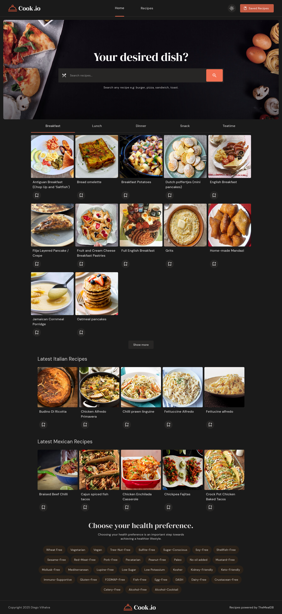
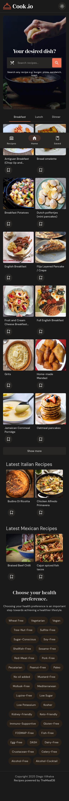

# 🍳 Cook.io

> Cooking made easy. Search, browse and save recipes from around the world.

**[🔗 Live demo](https://diegovilhalva.github.io/cook.io/)**

Cook.io is a recipe discovery app built with **Vite + vanilla JavaScript**. Search by name, browse by meal type or cuisine, save your favorites locally, and check full ingredients and instructions on the detail page — all with a clean, responsive UI and light/dark theme support.

---

## 📸 Screenshots

<p align="center">
  
</p>

<p align="center">
  
</p>

---

## ✨ Features

- 🔍 **Search** recipes by name
- 🍽️ **Browse by meal type** (Breakfast, Lunch, Dinner, Snack, Teatime) on the home page
- 🌍 **Browse by cuisine** (Italian, Mexican, and more) via recipe sliders
- 📖 **Recipe detail page** with ingredients, instructions, category, cuisine and a YouTube link when available
- 🔖 **Save recipes** to a personal recipe book, stored locally in the browser (no account needed)
- 🌓 **Light / dark theme**, remembered between visits
- 📱 **Fully responsive**, from mobile to desktop

---

## 🛠️ Tech stack

- [Vite](https://vitejs.dev/) — dev server & build tool
- Vanilla JavaScript (ES modules), no frameworks
- CSS with custom properties for theming
- [TheMealDB API](https://www.themealdb.com/) — recipe data
- `localStorage` — saved recipes & theme preference
- Deployed on **GitHub Pages**

---

## 🔄 About the API migration

Cook.io originally ran on the **Edamam Recipe API**. When that API key's free tier access was cut off, the project was migrated to **[TheMealDB](https://www.themealdb.com/)**, which offers a genuinely free, client-side-friendly tier.

That migration came with a few intentional trade-offs worth knowing about:

- TheMealDB has no cooking time, calorie, diet or health-label data, so those filters remain in the UI but currently have no effect on results.
- Filtering only supports **one dimension at a time** (search *or* category *or* cuisine *or* ingredient — never combined), since that's how TheMealDB's free filter endpoint works.
- Meal type (Breakfast/Lunch/Dinner/Snack/Teatime) and dish type filters are mapped to the closest matching TheMealDB category, since TheMealDB doesn't have those concepts natively.
- Recipe images are requested in TheMealDB's `/medium` size variant, and slider sections are loaded with a short staggered delay, to avoid bursts of image requests against their free image host.

---

## 🚀 Running locally

```bash
# Clone the repository
git clone https://github.com/diegovilhalva/cook.io.git
cd cook.io

# Install dependencies
npm install

# Start the dev server
npm run dev
```

The app will be available at `http://localhost:5173` (or the next available port).

To build for production:

```bash
npm run build
```

---

## 📁 Project structure

```
cook.io/
├── index.html              # Home page
├── recipes.html             # Browse / search / filter page
├── detail.html               # Recipe detail page
├── saved-recipes.html        # Saved recipes page
└── src/
    └── assets/
        ├── css/
        │   └── style.css      # All styling, theming, responsive layout
        └── js/
            ├── api.js          # Fetch wrapper for TheMealDB
            ├── global.js        # Shared utilities, save/unsave logic, snackbar
            ├── module.js         # Ingredient & tag helpers
            ├── home.js            # Home page logic (tabs, sliders, search)
            ├── recipes.js          # Browse/search/filter page logic
            ├── detail.js            # Recipe detail page logic
            ├── saved_recipes.js      # Saved recipes page logic
            └── theme.js                # Light/dark theme toggle
```

---

## 🙏 Credits

Recipe data and images powered by **[TheMealDB](https://www.themealdb.com/)**.

---

## 📄 License

This project is licensed under the [MIT License](./LICENSE).

---

Made by **Diego Vilhalva**